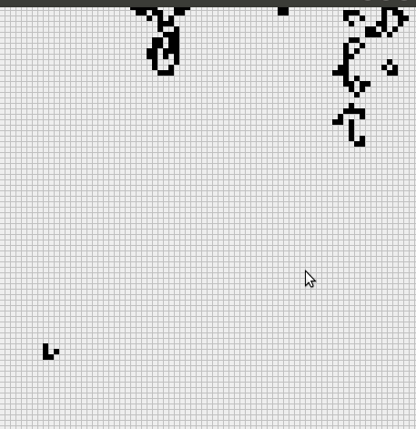

# gameOfLifeWithUI

This is my very first implementation of popular [Conway's Game of Life](https://en.wikipedia.org/wiki/Conway%27s_Game_of_Life) with ui implemented using swing, which I did somewhere at the end of 2014.

Unfortunately I lost the source code, so what you see here is a result of decompiler from original jar file.

I improved the decompiled code a little only to be able to compile it back. 

I think that the original code might have been written in groovy, but I am not sure.

The original jar file is in the releases tab.

Demo:

